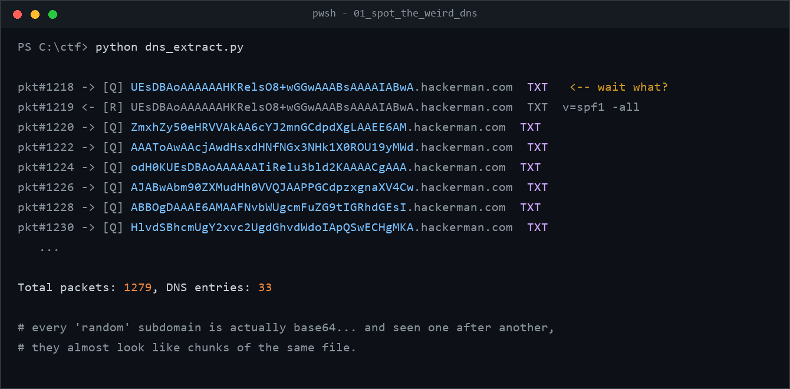
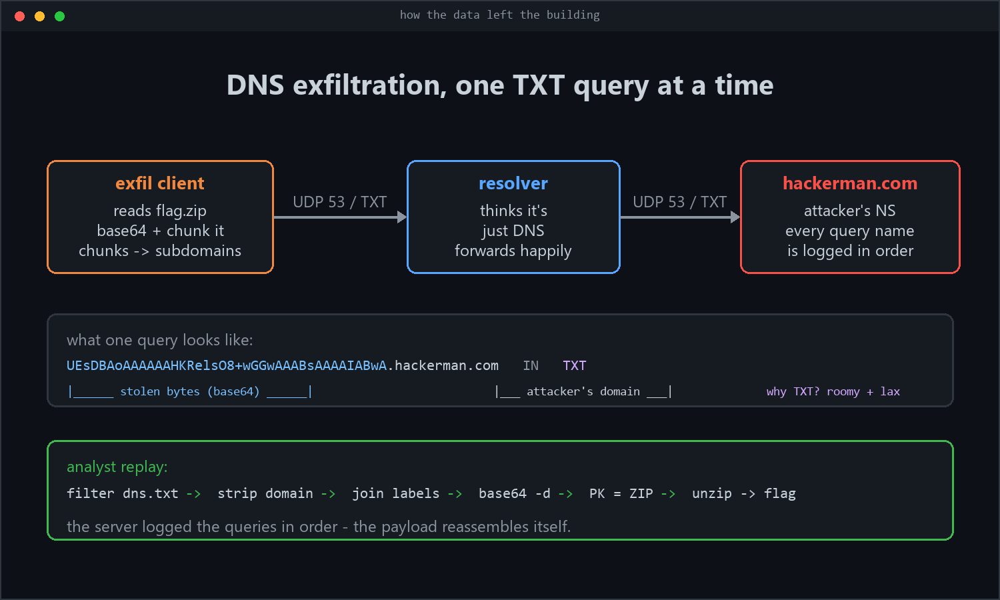
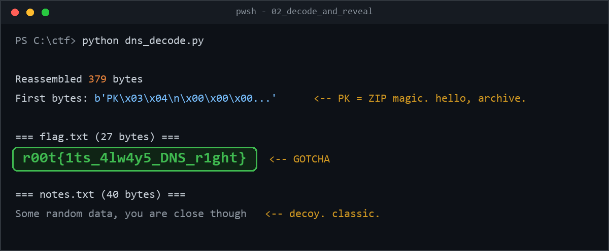

# Packet Whisperer — The One Where DNS Snitched on Itself

**Date:** 2026-09-23
**Author:** z3ro
**Platform:** AfricaHackon — *Packet Whisperer* by p3rf3ctr00t
**Category:** Network Forensics | **Difficulty:** Easy | **Points:** 100

---

## TL;DR

Someone slid a ZIP archive out of a network using nothing but DNS TXT queries.
Each query name was a base64 chunk of the file, disguised as a subdomain of
`hackerman.com`. Grab the pcap, rip out the queries, strip the domain, join the
labels, base64-decode the blob, and `flag.txt` falls out.

**Flag:** `r00t{1ts_4lw4y5_DNS_r1ght}`

Now the long version, because the *why* is the fun part.

---

## What you're handed

The challenge gives you exactly one thing: `chall.pcap`. The description is
deliberately vague:

> *"Analyze the provided PCAP and identify the hidden DNS-related flag."*

"DNS-related" is doing a lot of heavy lifting in that sentence. That's our hint.

## Step 0 — First impressions

Opening a pcap blind is like walking into a room where everyone is talking at
once: you don't listen to individuals, you listen for the *weird* voice in the
room. The file is small — 1,279 packets — so instead of drowning in Wireshark
statistics windows, I went straight for the throat: **only DNS, only the
question names.**

Quick sanity filter (what I'd type in Wireshark if you prefer clicking):

```
dns
```

But I wanted to *script* this, because I had a feeling I'd be doing a transform
on whatever I found. No tshark on this box, no scapy — so I wrote a tiny
pure-Python pcap instead. pcaps are dead simple:

- 24-byte global header
- per packet: 16-byte record header, then the raw frame
- Ethernet → IPv4 → UDP → DNS (we only care about port 53)

The parser pulls out every query/answer name and prints it. Full source:
[dns_extract.py](assets/packet-whisperer/dns_extract.py)

## Step 1 — The "wait, what?" moment

Running the extractor immediately pays off:



Look at that. A burst of **TXT record queries** for domains like:

```
UEsDBAoAAAAAAHKRelsO8+wGGwAAABsAAAAIABwA.hackerman.com
```

Three things should make your spidey-sense tingle here:

1. **Nobody legitimately queries TXT records for 50-character random-looking subdomains.**
   TXT is mostly SPF/DKIM/verification stuff, and the first label is usually
   short or a known token.
2. **The "random" strings aren't random.** Look at the alphabet: `A–Z a–z 0–9
   + /` (and one `==` at the very end of the last query). That's the base64
   alphabet staring at you.
3. **They're sequential and burst-y** — packets #1218 through #1250, nice and
   tidy, like a script fired them off.

If you've never seen this before, what you're looking at is called
**DNS exfiltration** (its cousin is *DNS tunneling*). The trick is beautiful and
depressing at the same time:

> You don't get to choose the *destination* of a DNS query — the resolver
> chases it for you — but you completely control the *question itself*. And if
> you own the authoritative nameserver for the domain being asked about, every
> question arrives at your doorstep, in order, logged forever.

So an attacker with a file to steal doesn't need an HTTP connection, an open
port, or anything that a firewall would blink at. They just need DNS — and DNS
is the one thing every network lets through on port 53 without a second look.

Here's the whole attack in one picture:



The punchline: *the pcap contains the entire stolen file*. Every query is a
carrying pigeon, and the pcap caught all the pigeons. We just have to read the
little scrolls in order.

## Step 2 — Carving the chunks out

For each query name I care about exactly one thing: the part before
`.hackerman.com`. Note that some chunks were split across *multiple* DNS labels
because a single label maxes out at 63 characters — so you can't just take the
first label; you have to strip the domain and **rejoin the remaining labels
without dots**:

```python
if name.endswith(".hackerman.com"):
    b64 = name[:-len(".hackerman.com")].replace(".", "")
    chunks.append(b64)
```

One subtlety worth knowing: only collect the **queries** (the client → server
direction, i.e. destination port 53). The pcap also contains responses, and the
responses echo the same names back — if you grab both, you'll decode every chunk
twice and corrupt the file. (Ask me how I know. Actually don't. It was 30
seconds of confusion.)

## Step 3 — The base64 blob says hello

Concatenate the chunks, `base64.b64decode`, and look at the first bytes:

```
b'PK\x03\x04\n\x00\x00\x00\x00\x00r\x91z[...'
```

`PK` — as in *Phil Katz* — is the magic signature of every ZIP file on Earth.
The very first chunk being `UEsDB...` makes total sense in hindsight:
base64 of `PK\x03\x04` starts with `UEsDB`. That's why the first query *looked*
so familiar even before decoding.

Hand the decoded bytes to Python's `zipfile` and it politely lists the contents.
Full script: [dns_decode.py](assets/packet-whisperer/dns_decode.py)

## Step 4 — Free flag inside



Two files in the archive:

- **`notes.txt`** — *"Some random data, you are close though"* — a decoy, and a
  bit of trolling from the challenge author. Respect.
- **`flag.txt`** — the actual prize:

```
r00t{1ts_4lw4y5_DNS_r1ght}
```

Submitted, 100/100, done.

## Why this works (and why you should care at 2 AM as a defender)

DNS exfiltration keeps showing up in real breaches because it exploits three
uncomfortable truths:

1. **DNS is rarely inspected.** Firewalls obsess over HTTP and SMTP while port
   53 traffic strolls by.
2. **Query names are user-controlled by design.** That's not a bug; it's how
   DNS works. Abuse is indistinguishable from use *until you look at volume and
   shape*.
3. **The authoritative server gets a perfect, ordered log.** The attacker
   doesn't even need to receive answers — they just read their own query logs.

The tells from this exact challenge are the same ones you'd hunt for in prod:

- Subdomain labels at or near the **63-char label limit** (padding maxes out throughput)
- Lots of **TXT/NULL/CNAME queries to a single rare domain** in a short window
- High-entropy (base64-looking) query names under one parent domain
- A burst where **queries outnumber answers** or answers are trivially short

One weird query is a resolver hiccup. Seventeen in a row at 63 chars a pop is
somebody's filing cabinet leaving the building.

## Recap — the whole solve in six moves

1. Isolate port-53 traffic in the pcap.
2. Notice freaky TXT queries to `*.hackerman.com`.
3. Per query: strip the domain, glue labels back into one base64 string.
4. Concatenate all strings **in packet order**, decode.
5. `PK` magic → it's a ZIP → extract.
6. Read `flag.txt`, ignore the troll note, bank the points.

It's always DNS. The flag said so itself.

---

*Solver scripts: [dns_extract.py](assets/packet-whisperer/dns_extract.py) ·
[dns_decode.py](assets/packet-whisperer/dns_decode.py)*
